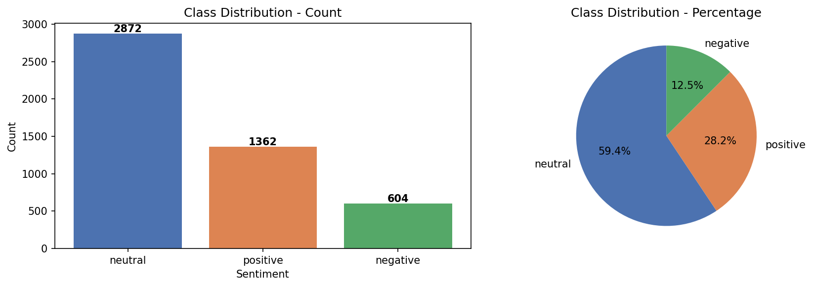
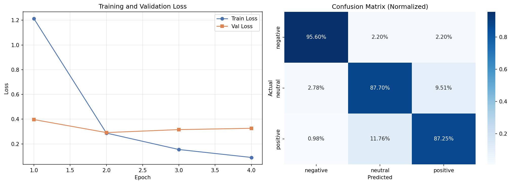
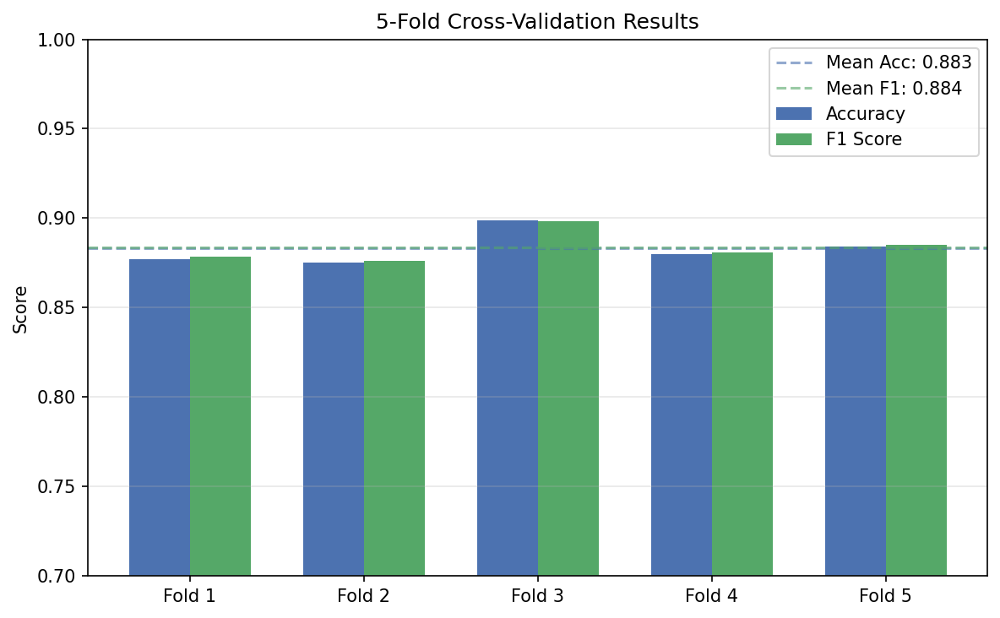

# Financial Sentiment Analysis with FinBERT

End-to-end financial sentiment analysis system built on the Financial PhraseBank dataset. Fine-tunes ProsusAI/finbert using custom weighted cross-entropy loss with 5-fold cross-validation, and deploys a production-ready REST API with FastAPI, SQLite prediction logging, and an interactive web interface.

---

## Results Summary

| Metric | Score |
|---|---|
| Test Accuracy | 88.57% |
| Weighted F1 | 88.65% |
| CV Mean Accuracy | 88.30% +/- 0.85% |
| CV Mean F1 | 88.39% +/- 0.79% |

---

## Project Structure

```
Financial-Sentiment-FinBERT/
├── notebooks/
│   └── finbert_training.ipynb     # Full training pipeline: EDA, fine-tuning, evaluation
├── app/
│   ├── main.py                    # FastAPI application with all endpoints
│   ├── predictor.py               # SentimentPredictor class for model inference
│   ├── database.py                # SQLite prediction logging and retrieval
│   ├── models.py                  # Pydantic request and response schemas
│   └── static/
│       └── index.html             # Interactive web UI
├── tests/
│   ├── conftest.py                # Pytest fixtures and test setup
│   └── test_api.py                # Unit tests for all API endpoints
├── requirements.txt
└── README.md
```

---

## Visualizations

### Class Distribution


### Training and Validation Loss


### 5-Fold Cross-Validation Results


---

## Notebook Overview

### finbert_training.ipynb

- Loads 4,838 financial sentences from Financial PhraseBank dataset
- EDA: class distribution (59.4% neutral, 28.2% positive, 12.5% negative) and text length analysis
- Cleans and tokenizes text using BertTokenizer with max sequence length 64
- Computes inverse frequency class weights: negative=1.814, neutral=0.382, positive=0.804
- Fine-tunes ProsusAI/finbert with custom weighted CrossEntropyLoss over 4 epochs
- Stratified 5-fold cross-validation for robust generalization estimate
- Final evaluation on held-out 15% test set with classification report and confusion matrix
- Saves fine-tuned model and tokenizer to disk for API deployment

---

## Methodology

### Why Weighted Cross-Entropy Loss?

The Financial PhraseBank dataset has significant class imbalance — 59.4% neutral, 28.2% positive, and only 12.5% negative sentences. Without weighting, the model would optimize for the majority class and underperform on minority classes. Inverse frequency weights (weight = total / (n_classes x count)) penalize majority class predictions and force the model to learn meaningful features for all three sentiment classes. The result is 96% recall on the negative class despite it being the smallest class.

### Why Stratified 5-Fold Cross-Validation?

A single train/test split on a 4,838 sample dataset can produce unreliable estimates depending on which samples end up in which split. Stratified 5-fold cross-validation evaluates the model on all data points while maintaining class proportions in each fold, giving a much more reliable estimate of generalization performance. The low standard deviation across folds (0.85% accuracy, 0.79% F1) confirms the model is consistent and not overfitting to a particular split.

### Why FinBERT over standard BERT?

Standard BERT is pre-trained on general text (Wikipedia, BooksCorpus) which does not capture financial language nuances such as sector-specific terminology, earnings report phrasing, and market sentiment expressions. FinBERT (ProsusAI) is further pre-trained on a large financial corpus before being fine-tuned, giving it domain-adapted representations that outperform general BERT on financial NLP tasks.

---

## API Endpoints

| Method | Endpoint | Description |
|---|---|---|
| GET | `/` | Interactive web UI |
| GET | `/health` | Model and API health check |
| POST | `/predict` | Single text sentiment prediction |
| POST | `/predict/batch` | Batch sentiment prediction (max 32) |
| GET | `/history` | Recent prediction history from SQLite |
| GET | `/stats` | Aggregate sentiment distribution stats |

---

## Setup

```bash
# Clone repository
git clone https://github.com/karthik-1604/Financial-Sentiment-FinBERT.git
cd Financial-Sentiment-FinBERT

# Create virtual environment
python -m venv venv
venv\Scripts\activate        # Windows
source venv/bin/activate     # Mac/Linux

# Install dependencies
pip install -r requirements.txt

# Download fine-tuned model
# Run finbert_training.ipynb on Kaggle with GPU
# Dataset: ankurzing/sentiment-analysis-for-financial-news
# Download finbert_finetuned/ folder and place in project root

# Run API
cd app
uvicorn main:app --reload

# Run tests
cd ..
pytest tests/test_api.py -v
```

Open `http://127.0.0.1:8000` for the interactive UI or `http://127.0.0.1:8000/docs` for the Swagger API documentation.

---

## Example API Usage

```python
import requests

# Single prediction
response = requests.post('http://127.0.0.1:8000/predict', json={
    'text': 'The company reported record profits and raised its annual dividend by 25%.'
})
print(response.json())
# {
#   "text": "The company reported record profits...",
#   "sentiment": "positive",
#   "confidence": 0.9902,
#   "probabilities": {"negative": 0.0008, "neutral": 0.0029, "positive": 0.9902}
# }

# Batch prediction
response = requests.post('http://127.0.0.1:8000/predict/batch', json={
    'texts': [
        'Revenue grew 20% year over year.',
        'The firm faces serious liquidity concerns.',
        'The board approved a share buyback program.'
    ]
})
print(response.json())
```

---

## Technologies

Python, PyTorch, Transformers, FastAPI, SQLite, Pydantic, pytest, pandas, scikit-learn, matplotlib, seaborn

---

## Dataset

Source: Financial PhraseBank (Malo et al., 2014) via Kaggle — `ankurzing/sentiment-analysis-for-financial-news`

4,838 financial sentences from English-language news annotated by finance professionals with positive, negative, and neutral sentiment labels.